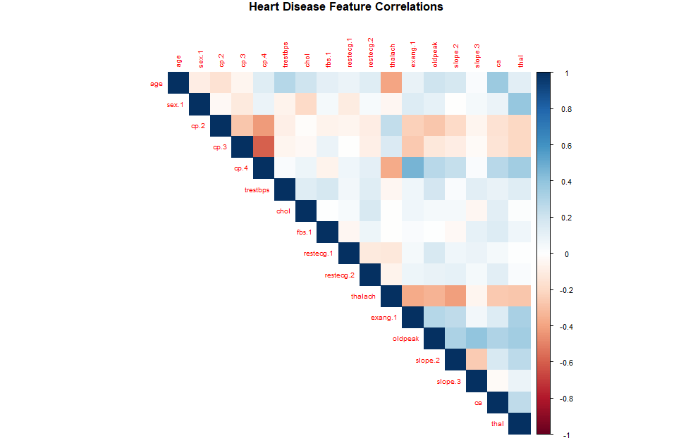
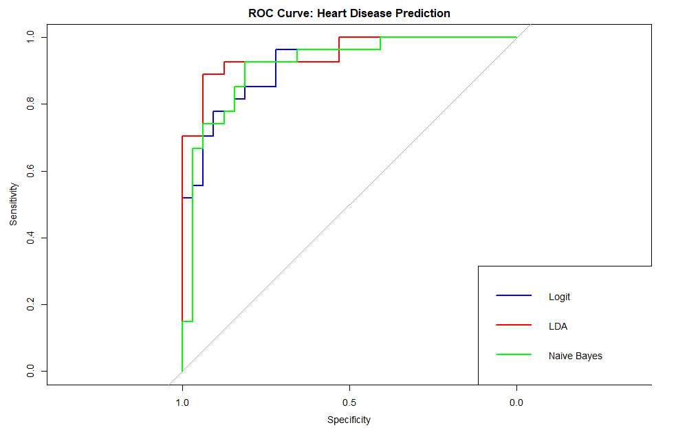

# **Clinical Prediction of Cardiovascular Disease: A Classification Machine Learning Project**
## **📌 Executive Summary**

**The Problem:** Cardiovascular diseases remain the leading cause of global mortality. Early and accurate detection through clinical biomarkers is essential for life-saving interventions and reducing the burden on healthcare systems.

**The Solution:** Using the **UCI Cleveland Heart Disease dataset**, I developed a diagnostic pipeline in **R**. I implemented and compared **Logistic Regression, Linear Discriminant Analysis (LDA), and Naive Bayes** to identify the most reliable classifier for clinical decision support.

**The Result:** * **Top Performer:** **Linear Discriminant Analysis (LDA)** emerged as the superior model, achieving a high **Accuracy of 84.75%** and an exceptional **ROC-AUC of 0.9491**.

* **Clinical Priority:** In a medical context, **Recall (Sensitivity)** is the primary metric. Both LDA and Naive Bayes achieved a **Recall of 92.59%**, successfully identifying 9 out of every 10 symptomatic patients, which is critical for minimizing dangerous "False Negatives."

---

## **🛠️ Tech Stack & Libraries**

* **Language:** R
* **Core Libraries:** `tidyverse` (Data Wrangling), `caret` (Preprocessing), `MASS` (LDA), `e1071` (Naive Bayes), `pROC` (AUC Evaluation), `car` (VIF Diagnostics).

---

## **📂 Data Description**

The dataset consists of clinical attributes used to determine heart disease status:

| Variable | Description | Type |
| --- | --- | --- |
| **Age** | Patient age in years | Numeric |
| **Sex** | 1 = Male; 0 = Female | Categorical |
| **CP** | Chest pain type (4 levels) | Categorical |
| **Trestbps** | Resting blood pressure (mm Hg) | Numeric |
| **Chol** | Serum cholesterol in mg/dl | Numeric |
| **Thalach** | Maximum heart rate achieved | Numeric |
| **Exang** | Exercise-induced angina | Categorical |
| **Oldpeak** | ST depression induced by exercise | Numeric |
| **CA** | Number of major vessels (0-3) colored by fluoroscopy | Numeric |
| **Target** | Presence (Yes) or Absence (No) of disease | **Target** |

---

## **📈 Project Workflow**

### **1. Data Cleaning & Transformation**

* **Imputation:** Handled missing values in medical indicators (`ca` and `thal`) using median imputation to maintain a full clinical record.
* **Target Re-coding:** Transformed the original multi-class severity scale (0–4) into a binary classification problem: **Disease Presence vs. Absence**.
* **One-Hot Encoding:** Applied **Full-Rank Dummy Encoding** to handle categorical variables correctly, avoiding the "Dummy Variable Trap" and ensuring model stability.

### **2. Statistical Diagnostics**

* **Standardization:** Applied **Z-score Scaling** to all numeric features. This ensures that models like LDA aren't biased by features with larger scales (e.g., Cholesterol vs. Oldpeak).
* **Multicollinearity:** Verified feature independence using **VIF**. All variables showed VIF values below **3.2**, confirming a healthy, non-redundant feature set for the parametric models.

### **3. Model Comparison & Results**

Metrics were calculated on an 80/20 train-test split.

| Model | Accuracy | **ROC-AUC** | Precision | **Recall** | F1-Score |
| --- | --- | --- | --- | --- | --- |
| **LDA** | **84.75%** | **0.9491** | **78.13%** | **92.59%** | **0.8475** |
| **Logistic Regression** | 79.66% | 0.9167 | 72.73% | 88.89% | 0.8000 |
| **Naive Bayes** | 79.66% | 0.9144 | 71.43% | **92.59%** | 0.8065 |

---

## **💡 Clinical Insights**

The **Logistic Regression** model identified several highly significant predictors ($p < 0.05$) of heart disease:

1. **Major Vessels (ca):** The strongest predictor in the model ($p < 0.001$). A higher number of major vessels colored by fluoroscopy correlates significantly with disease presence.
2. **Resting Blood Pressure (trestbps):** Higher resting blood pressure showed a significant positive correlation with heart disease risk.
3. **Sex:** Male patients (`sex.1`) showed a higher log-odds of heart disease compared to female patients in this clinical sample.
4. **Chest Pain (cp.4):** Asymptomatic chest pain was a statistically significant indicator of underlying cardiovascular issues.

---

## **📊 Visual Analytics**

### **1. Feature Correlation Matrix**

*Figure 1: Heatmap visualizing clinical feature dependencies.*

### **2. Model Performance (ROC Curve)**

*Figure 2: ROC curve comparison illustrating the high diagnostic power of the LDA model.*

---

## **🚀 Conclusion**

The **LDA model** proved to be the most effective diagnostic tool, providing the highest AUC and a strong balance between Precision and Recall. By achieving a **Recall of 92.6%**, this pipeline demonstrates its value as a clinical screening tool that minimizes the risk of overlooking symptomatic patients.
